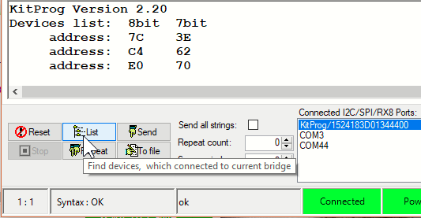
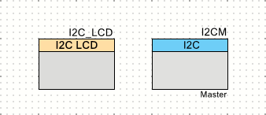

# CY8CKIT-042-BLE-A でLCD表示

これは、[PSoC Advent Calendar 2019]の7日目に突っ込まれた記事です。

## LCD表示器が入ってる

[前回の記事][GLChika]では、[**Grove**][Grove]の[スターターキット][Grove Starter Kit]に入っていた[**Grove LED**][Grove LED]というボードを使いました。


[スターターキット][Grove Starter Kit]には、他のボードも入っています。その中で、一番大きいのが[**Grove LCD RGB Backlight**][Grove LCD RGB Backlight]です。


良く見かけるパラレルバスのボードとは違って、これは**I2C**インターフェイスの表示器です。
これなら、[**Grove**][Grove]の4ピンコネクタにぴったりです。
今回は、このボードを使ってみます。


## ハードウェアを接続してみる

さっそく、[**CY8CKIT-042-BLE-A**][CY8CKIT-042-BLE-A]につないでみます。
接続する場所は、**I2C**と書いてあるコネクタです。


**I2C**の規格では、一つのバスに複数のデバイスを接続することができます。
[**Base Shield V2**][Base Shield V2]には、**I2C**コネクタが4個並んでいるので、4個同時にバスに接続することができます。

この**I2C**のバスは、[**CY8CKIT-042-BLE-A**][CY8CKIT-042-BLE-A]評価ボード上で、[**KitProg**][KitProg]のUSB-I2C変換ポートにも接続されています。
そのため、[**PSoC Creator**][PSoC Creator]と一緒にインストールされている[**Bridge Control Panel**][Bridge Control Panel]アプリケーションを使用して**I2C**のSlaveデバイスを直接操作することもできます。
例えば、[**Bridge Control Panel**][Bridge Control Panel]の"List"ボタンをクリックすると、**I2C**バス上に接続されたSlaveデバイスの一覧が出てきます。



これによると、[**Bridge Control Panel**][Bridge Control Panel]から三つのSlaveアドレスが見えていることがわかります。
それぞれのアドレスは、以下のように使われています。

|8bit|7bit|デバイス|
|:-:|:-:|:---|
|7C|3E|LCD Controller|
|C4|62|LED Driver|
|E0|70|LED Driver|


## I2C接続のLCDコントローラがあるじゃないか

[**Grove**][Grove]シリーズのボードは、回路図やサンプルソフトウェアが提供されているのですが、この[**Grove LCD RGB Backlight**][Grove LCD RGB Backlight]に限っては回路図が提供されていません。
そのため、使用されているLCDコントローラの型番もわからず、仕様書も取り寄せられません。
こりゃ、サンプルソフトウェアを読んで推測するしかなさそうです。

と悩んでいましたが、[**PSoC Creator**][PSoC Creator]が**Character LCD with I2C Interface**というコンポーネントを持っている事に気が付きました。


**Configuration Tool**を見てみると、"NXP PCF2119x + custom commands"というラジオボタンがありました。
もしかしたら、この[**PCF2119x**][PCF2119x]というのがデファクトスタンダードで、このコマンド体系を使えばいけるんじゃね？


## とりあえず表示させる

というわけで、[**PCF2119X**][PCF2119X]であるという前提で表示させてみることにしました。

### 回路図

回路図は、必要なコンポーネントを並べただけです。



この**Character LCD with I2C Interface**というコンポーネントは、**I2C Master**を操作してLCDコントローラと通信をするソフトウェアコンポーネントです。
そのため、外付けの**I2C Master**コンポーネントが別途必要です。


### I2C Masterの設定

**I2C Master**の設定は、以下のようにしました。


|項目|設定|概要|
|:--|:--|:--|
|Name|I2CM|このインスタンスの名前です。|
|Mode|Master|Slaveデバイスを制御します。|

別途、端子の割り当てが必要です。[**CY8CKIT-042-BLE-A**][CY8CKIT-042-BLE-A]では、以下の端子が**SCL**と**SDA**に接続されています。


### I2Cバスのプルアップは、どこ？

通常、**I2C**バスを使用する時には、**SCL**, **SDA** 信号線にプルアップ抵抗を付ける必要があります。
この実験でもプルアップ抵抗が必要になるはずなのですが、無くても動いてしまいます。
これは、[**CY8CKIT-042-BLE-A**][CY8CKIT-042-BLE-A]ボード上に搭載されている[**KitProg**][KitProg]がプルアップ抵抗を付けてくれるためです。


このため、他のポートを**I2C**バスに使用する場合や、**USB**コネクタ以外から電源を供給する場合には、プルアップ抵抗を追加しなくてはなりません。
**I2C**バスを使用する場合には、一般的に注意が必要です。


### LCDコントローラの設定

**Character LCD with I2C Interface**の設定は、以下のようにしました。


|項目|設定|概要|
|:--|:--|:--|
|Name|I2C_LCD|このインスタンスの名前です。|
|I2C master instance name|I2CM|操作対象である**I2C Master**の名前です。|
|Default I2C address (8 bit)|0x7C|LCDコントローラのSlaveアドレスです。|
|Command format|NXP PCF2119x + custom commands|ひとまず[**PCF2119x**][PCF2119x]だと思って使います。|

**I2C master instance name**には、先ほど作った**I2C Master**コンポーネントの名前を入れます。

**Slaveアドレス**は、[**Bridge Control Panel**][Bridge Control Panel]が調べてくれたアドレスを"8 bit"フォーマットで入れます。


### ソフトウェア

ソフトウェアは、表示器いっぱいに文字を表示させるプログラムとしました。

```c:main.c
#include "project.h"

int main(void) {
    CyGlobalIntEnable; /* Enable global interrupts. */

    I2CM_Start();
    I2C_LCD_Start();
    
    for (uint32_t i = 0x30; i <= 0x6F; i++) {
        I2C_LCD_PutChar(i);
    }

    for (;;) {
        /* Place your application code here. */
    }
}
```

初期設定したら、0x3F ('0') から 0x6F ('o') までの48文字を送り込むだけのプログラムです。


### うまく表示されない

実行させてみましたが、うまく表示されませんでした。


フォントが間違っているうえに1行しか表示されていません。
つまり、LCDコントローラが[**PCF2119x**][PCF2119x]ではないという事を意味しているのですね。
とはいえ、何かを表示させようとする努力は見られるので何とかなるでしょう。


## Custom formatを使う

とりあえず、[**PCF2119x**][PCF2119x]としては動いていないらしいので、"Custom format"設定を使って試してみました。


フォントの乱れは無くなりました。が、2行表示になりません。

"Custom format"に設定すると、"Custom Command"タブにデフォルトのコマンド情報が入り、変更できるようになります。


これらのコマンドを見ていて、"Set display for 2 lines and 16 characters"というコマンドを見つけました。設定値は、0x24となっています。
これは、"Function_set"というコマンドで、[**PCF2119x**][PCF2119x]のデータシートでは以下のように書かれています。

|Instruction|RS|R/W|bit7|bit6|bit5|bit4|bit3|bit2|bit1|bit0|
|:--|:-:|:-:|:-:|:-:|:-:|:-:|:-:|:-:|:-:|:-:|
|Function_set|0|0|0|0|1|DL|-|M|SL|H|

DL: データバス幅 0:4bit 1:8bit  
M: 表示行数 0:1-line 1:2-line  
SL: multiplexモード 0:18-multiplex 1:9-multiplex  
H: 命令セット 0:標準命令 1:拡張命令  

**I2C**の場合には、DLは関係ありません。[**PCF2119x**][PCF2119x]であれば、確かに2行表示ができる設定です。

これに対して、一般的な **HD44780 (SC1602)** コントローラのコマンドを調べると、このようになっていました。

|Instruction|RS|R/W|bit7|bit6|bit5|bit4|bit3|bit2|bit1|bit0|
|:--|:-:|:-:|:-:|:-:|:-:|:-:|:-:|:-:|:-:|:-:|
|Function_set|0|0|0|0|1|DL|N|F|-|-|

DL: データバス幅 0:4bit 1:8bit  
N: 表示行数 0:1-line 1:2-line  
F: フォントのドット数 0:5x8 1:5x10  

比較してみるとわかりますが、2行表示設定にするためのビット位置が異なっています。
もし、このLCDコントローラのコマンド体系が **HD44780 (SC1602)** 同等だったとすると、0x24を送ると1-line, 5x10フォントという妙な設定になってしまいます。
2行表示をしたいのであれば、0x28を送らなくてはなりません。コマンドを0x28に変更してみました。


すると、思った通りの出力になりました。


## GitHub リポジトリ
* [GitHub Repository][repository]

## 関連サイト
* [32-bit ArmR CortexR-M0 PSoCR 4][PSoC 4]
* [PSoCR 4 BLE (Bluetooth Smart)][PSoC 4 BLE]
* [スイッチサイエンスのスターターキットのページ][ssci Starter Kit]

## 関連記事
* [CY8CKIT-042-BLE-A でＬチカ][GLChika]
* [CY8CKIT-042-BLE-A でLCD表示][GLCDShow]
* [CY8CKIT-042-BLE-A でバックライト点灯][GBLChika]
* [CY8CKIT-042-BLE-A で気圧を表示][GBarometer]
* [CY8CKIT-042-BLE-A で気圧を送信][GBLE]

[GLChika]:./chap1.md
[GLCDShow]:./chap2.md
[GBLChika]:./chap3.md
[GBarometer]:./chap4.md
[GBLE]:./chap5.md
[PSoC Advent Calendar 2019]:https://qiita.com/advent-calendar/2019/psoc
[Switch Science]:https://www.switch-science.com/
[Seeed Studio]:https://www.seeedstudio.com/
[Grove]:https://www.seeedstudio.com/Grove
[Grove Starter Kit]:https://www.seeedstudio.com/Grove-Starter-Kit-for-Arduino-p-1855.html
[ssci Starter Kit]:https://www.switch-science.com/catalog/1812/
[Grove LCD RGB Backlight]:https://www.seeedstudio.com/Grove-LCD-RGB-Backlight.html
[CY8CKIT-042-BLE-A]:https://www.cypress.com/cy8ckit-042-ble-a
[Base Shield V2]:https://www.seeedstudio.com/Base-Shield-V2.html
[Grove LED]:https://www.seeedstudio.com/Grove-Red-LED.html
[PSoC 4]:https://www.cypress.com/psoc4
[PSoC 4 BLE]:https://www.cypress.com/products/psoc-4-ble-bluetooth-smart
[Bridge Control Panel]:https://www.cypress.com/documentation/software-and-drivers/psoc-programmer-secondary-software
[PSoC Creator]:https://www.cypress.com/creator
[PCF2119X]:https://www.nxp.com/products/peripherals-and-logic/lcd-drivers/lcd-character-drivers/lcd-controllers-drivers:PCF2119X
[KitProg]:https://www.cypress.com/kitprog
[repository]:https://github.com/noritan/Advent2019
