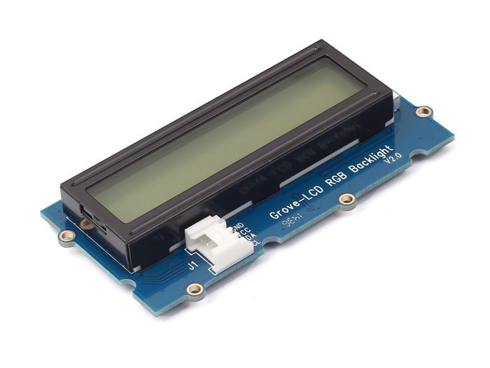
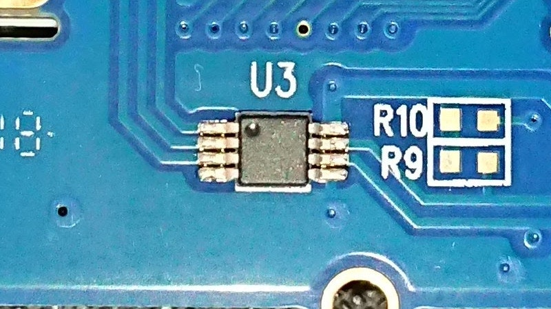
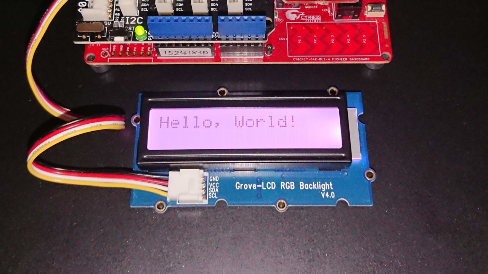
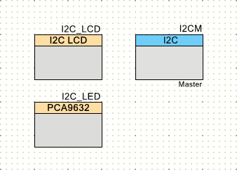
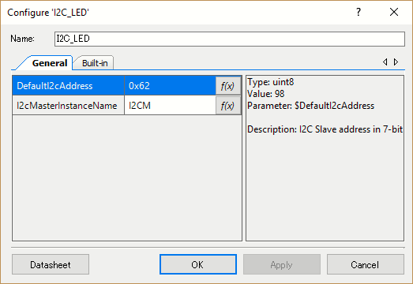

# CY8CKIT-042-BLE-A でバックライト点灯

これは、[PSoC Advent Calendar 2019]の10日目に突っ込まれた記事です。

## LCD表示器にはバックライトがある

[前回の記事][GLcdShow]では、[**Grove**][Grove]の[スターターキット][Grove Starter Kit]に入っていた[**Grove LCD RGB Backlight**][Grove LCD RGB Backlight]というボードを使いました。



今回も、このボードを使って実験を行います。

このボードは、[**Grove LCD RGB Backlight**][Grove LCD RGB Backlight]という名前からもわかるようにバックライトを内蔵しています。
ところが、どうやって使うんだか例によって回路図が無いのでわかりません。
やっぱり、プログラム例を見るしかないのか。


## LEDドライバ

で、基板を眺めていて、裏側に**I2C**バスに直接つながっているチップがいると気が付きました。



この写真では全く見えませんが、マーキングの"9632"の文字を手掛かりに[**NXP**][NXP]の[**PCA9632**][PCA9632]というLEDドライバであるらしいことが分かりました。

[前回の記事][GLcdShow]で判明した**I2C**のSlaveアドレスとも符合します。

|8bit|7bit|デバイス|
|:-:|:-:|:---|
|7C|3E|LCD Controller|
|C4|62|LED Driver|
|E0|70|LED Driver|

このLEDドライバには、二つのアドレスが見えています。
これらのうち、0xC4が通常使用されるSlaveアドレスです。
一方、0xE0の方は、"LED All Call I2C-bus Address"と呼ばれるもので、モード設定によって無効にすることもできます。

このLEDドライバには、ほかにもサブアドレスが3種類設定できるなど機能が多いのですが、すべてvolatileとなっています。
同一**I2C**バスに[**PCA9632**][PCA9632]を複数接続しても、個別に設定することができずに困ってしまうんじゃないのかな。

ちなみに、[**PCA9632**][PCA9632]には10ピンパッケージのものもあり、増えた2ピンを使ってSlaveアドレスを変更できることができます。
複数つなげるときには、こちらを使えば良いのでしょう。


## I2C Masterを直接操作する

今回は、[前回][GLcdShow]のプロジェクトを拡張して対応してみます。
まず、回路図は、前回と同じです。


LEDドライバを制御する便利なコンポーネントは存在しないので、すべてソフトウェアで操作します。
ソフトウェアは、こんなになりました。

```c:main.c
#include "project.h"

#define     LED_ADDRESS     (0xC4)
#define     REG_MODE1       (0x00)
#define     REG_PWM         (0x02)
#define     REG_LEDOUT      (0x08)
#define     REG_CONTINUOUS  (0x80)
#define     MODE1_ENABLE    (0x00)
#define     MODE1_DISABLE   (0x10)
#define     LEDOUT_ENABLE   (0xAA)
#define     LEDOUT_DISABLE  (0x00)
#define     BUFF_SIZE       (16)

static uint8_t  buff[BUFF_SIZE];

void SendBuffer(uint32_t size) {
    I2CM_I2CMasterWriteBuf(
        LED_ADDRESS >> 1,
        buff,
        size,
        I2CM_I2C_MODE_COMPLETE_XFER
    );
    while (!(I2CM_I2CMasterStatus() & I2CM_I2C_MSTAT_WR_CMPLT)) {
        // Wait until I2C Master finishes transaction
    }
}

int main(void) {
    CyGlobalIntEnable; /* Enable global interrupts. */

    I2CM_Start();
    
    // Setup LCD display
    I2C_LCD_Start();
    I2C_LCD_PrintString("Hello, World!");
    
    // Setup Backlight LED
    buff[0] = REG_MODE1;
    buff[1] = MODE1_ENABLE;
    SendBuffer(2);
    buff[0] = REG_LEDOUT;
    buff[1] = LEDOUT_ENABLE;
    SendBuffer(2);
    buff[0] = REG_CONTINUOUS | REG_PWM;
    buff[1] = 0x33;
    buff[2] = 0x33;
    buff[3] = 0x88;
    SendBuffer(4);
    
    for (;;) {
        /* Place your application code here. */
    }
}
```

LCDディスプレイに文字を表示させてから、LEDドライバにコマンドを送り、 MODE1, LEDOUT, PWM の順にレジスタに値を書き込んでいきます。
これで、バックライトがピンクに点灯します。



**I2Cバス**にコマンドを送信する関数 SendBuffer() を定義しているので、多少はマシなはずですが、大したことやってるわけでもないのに、長いです。

この先、可読性を考えるのであれば、MODE1レジスタを書き換える関数やら、LEDOUTレジスタを書き換える関数やら、PWMレジスタを書き換える関数やら、色んなものが考えられますが、ベタにmain.cに書くべきものじゃありません。
ぜひとも、ライブラリ化したいところです。


## LEDドライバを制御するコンポーネント

ということで、コンポーネントを作っちゃいました。



このコンポーネントは、**Character LCD with I2C Interface**と同じように,
指定された**I2C Master**を介して[**PCA9632**][PCA9632]を制御するソフトウェアコンポーネントです。

ただし、凝った設定画面は作っていないので、かなり質素です。



二つのパラメータ、Slaveアドレスと操作対象となる**I2C Master**コンポーネントのインスタンス名が設定されます。


### API

提供しているAPI関数は、以下の通りです。

|API|概要|
|:--|:--|
|void I2C_LED_Init(void)|コンポーネントの初期設定を行います。|
|void I2C_LED_Enable(void)|LEDドライバの動作を開始します。|
|void I2C_LED_Disable(void)|LEDドライバの動作を停止します。|
|void I2C_LED_Start(void)|コンポーネントの使用を開始します。|
|void I2C_LED_Stop(void)|コンポーネントの使用を終了します。|
|void I2C_LED_WriteMode1(uint8 mode1)|MODE1レジスタに値を書き込みます。|
|void I2C_LED_WriteLedout(uint8 ledout)|LEDOUTレジスタに値を書き込みます。|
|void I2C_LED_WritePWM(uint8 pwm0, uint8 pwm1, uint8 pwm2, uint8 pwm3)|PWMレジスタに値を書き込みます。|

これらの関数を使って、[**PCA9632**][PCA9632]を制御します。
ほかにも色々と細かい設定はできるのですが、バックライトとしてはこのくらいで十分でしょう。


### メインルーチン

コンポーネントを使って、メインルーチンを書き直しました。

```c:main.c
#include "project.h"

int main(void) {
    CyGlobalIntEnable; /* Enable global interrupts. */

    I2CM_Start();
    
    // Setup LCD display
    I2C_LCD_Start();
    I2C_LCD_PrintString("Hello, World!");
    
    // Setup Backlight LED
    I2C_LED_Start();
    I2C_LED_WritePWM(0x33, 0x33, 0x88, 0x00);
    
    for (;;) {
        /* Place your application code here. */
    }
}
```

"main.c"は、すっかり簡素になりました。
このプログラムでも、コンポーネントを作成しない場合と同じようにピンク色になります。

## GitHub リポジトリ
* [GitHub Repository][repository]

## 関連サイト
* [32-bit ArmR CortexR-M0 PSoCR 4][PSoC 4]
* [PSoCR 4 BLE (Bluetooth Smart)][PSoC 4 BLE]
* [スイッチサイエンスのスターターキットのページ][ssci Starter Kit]

## 関連記事
* [CY8CKIT-042-BLE-A でＬチカ][GLChika]
* [CY8CKIT-042-BLE-A でLCD表示][GLCDShow]
* [CY8CKIT-042-BLE-A でバックライト点灯][GBLChika]
* [CY8CKIT-042-BLE-A で気圧を表示][GBarometer]
* [CY8CKIT-042-BLE-A で気圧を送信][GBLE]

[GLChika]:./chap1.md
[GLCDShow]:./chap2.md
[GBLChika]:./chap3.md
[GBarometer]:./chap4.md
[GBLE]:./chap5.md
[PSoC Advent Calendar 2019]:https://qiita.com/advent-calendar/2019/psoc
[Switch Science]:https://www.switch-science.com/
[Seeed Studio]:https://www.seeedstudio.com/
[Grove]:https://www.seeedstudio.com/Grove
[Grove Starter Kit]:https://www.seeedstudio.com/Grove-Starter-Kit-for-Arduino-p-1855.html
[ssci Starter Kit]:https://www.switch-science.com/catalog/1812/
[Grove LCD RGB Backlight]:https://www.seeedstudio.com/Grove-LCD-RGB-Backlight.html
[CY8CKIT-042-BLE-A]:https://www.cypress.com/cy8ckit-042-ble-a
[Base Shield V2]:https://www.seeedstudio.com/Base-Shield-V2.html
[Grove LED]:https://www.seeedstudio.com/Grove-Red-LED.html
[PSoC 4]:http://www.cypress.com/psoc4
[PSoC 4 BLE]:https://www.cypress.com/products/psoc-4-ble-bluetooth-smart
[Bridge Control Panel]:https://www.cypress.com/documentation/software-and-drivers/psoc-programmer-secondary-software
[PSoC Creator]:https://www.cypress.com/creator
[NXP]:https://www.nxp.com/
[PCF2119X]:https://www.nxp.com/products/:PCF2119X
[PCA9632]:https://www.nxp.com/products/:PCA9632
[KitProg]:https://www.cypress.com/kitprog
[repository]:https://github.com/noritan/Advent2019
