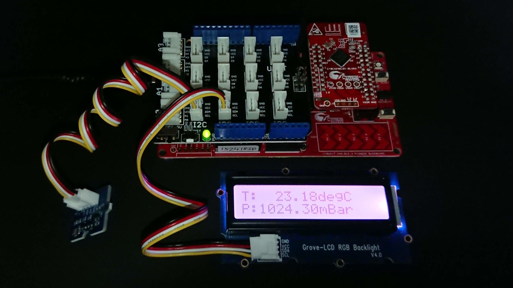
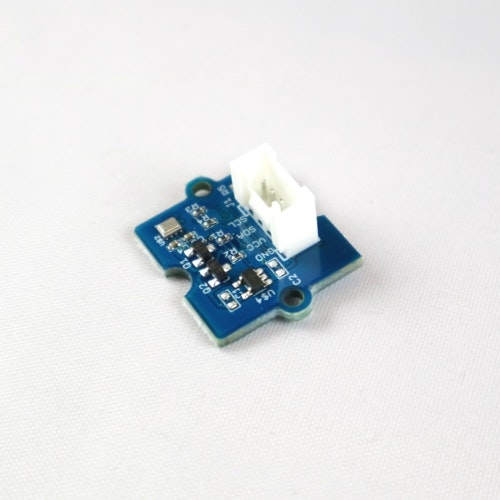
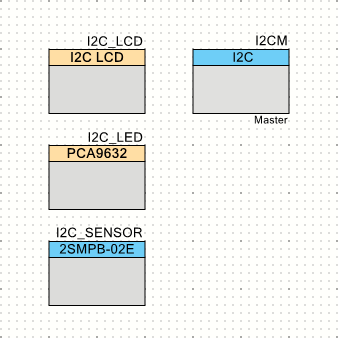

# CY8CKIT-042-BLE-A で気圧を表示

これは、[PSoC Advent Calendar 2019]の16日目に突っ込まれた記事です。

[前回の記事][GBLChika]では、[**Grove**][Grove]の[**スターターキット**][Grove Starter Kit]に入っていた[**Grove LCD RGB Backlight**][Grove LCD RGB Backlight]というボードを使ってLEDドライバを操作しました。
これまでに使ってきたLCD表示とLEDドライバは、**I2C**の**WRITE**シーケンスのみを使っています。
つまり、**PSoC**からデータを送りつけてばかりだったわけです。
今回は、これまた[スイッチサイエンス][Switch Science]で購入した[**絶対圧センサ評価モジュール**][ssci PSensor]からデータを取得して、[**Grove LCD RGB Backlight**][Grove LCD RGB Backlight]に表示します。




## 絶対圧センサ



[**絶対圧センサ評価モジュール**][ssci PSensor]とは、気圧を測定してくれるセンサを搭載した[**Grove**][Grove]コネクタ対応のボードです。
この基板の上には、[OMRON]製の缶詰になった(canned)[**2SMPB-02E**][2SMPB-02E]という気圧センサとレギュレータなどが搭載されています。
また、このセンサには、温度補償を行うための温度センサも内蔵しています。


## 気圧センサコンポーネント

これをどうやって操作するかと考えた結果、[前回の記事][GBLChika]と同じように、新たにコンポーネントを作成してしまう事にしました。



**I2C Master**を操作するためのソフトウェアコンポーネントを作成しました。
[前回の記事][GBLChika]と全く同じ考え方です。


### API
このソフトウェア・コンポーネントには、以下の**API**を実装しました。

|API|概要|
|:--|:--|
|void I2C_SENSOR_Init(void)|コンポーネントの初期設定を行います。|
|void I2C_SENSOR_Enable(void)|センサの動作を開始します。|
|void I2C_SENSOR_Disable(void)|センサの動作を停止します。|
|void I2C_SENSOR_Start(void)|コンポーネントの使用を開始します。|
|void I2C_SENSOR_Stop(void)|コンポーネントの使用を終了します。|
|void I2C_SENSOR_ReadCoefficient(void)|センサから補償パラメータを読みだしてコンポーネントに格納します。|
|uint32 I2C_SENSOR_IsMeasuring(void)|センサが測定中かどうかを判定します。まだ実装されていません。|
|void I2C_SENSOR_Sleep(void)|センサをSleepモードに遷移させます。|
|void I2C_SENSOR_Force(void)|センサに1回だけ測定させます。|
|void I2C_SENSOR_ReadRawData(void)|センサから測定したデータを取り出しコンポーネントに格納します。|
|double I2C_SENSOR_GetTemperature(void)|測定データから温度を計算して返します。|
|double I2C_SENSOR_GetPressure(void)|測定データから気圧を計算して返します。|

まだ、このプロジェクトで使用できるだけの**API**しか実装していません。


### I2CのREADシーケンス

このコンポーネントでは、**I2C**インターフェイスの**WRITE**シーケンスに加えて**READ**シーケンスを使用しています。
そのために、内部関数``I2C_SENSOR_ReceiveSequence()``を定義して使用しています。

```c:I2C_SENSOR.c
static uint32 I2C_SENSOR_ReceiveSequence(uint8 *rbuf, uint32 length) {
    // Clear status flags
    I2C_SENSOR_MasterClearStatus();
    // Receive a I2C packet
    (void) I2C_SENSOR_MasterReadBuf(
        I2C_SENSOR_address,
        rbuf,
        length,
        I2C_SENSOR_MODE_COMPLETE_XFER
    );
    
    while (!(I2C_SENSOR_MasterReadStatus() & I2C_SENSOR_READ_COMPLETE)) {
        // Wait until I2C Master finishes transaction
    }
    
    // Return the data length
    return I2C_SENSOR_MasterGetReadBufSize();
}
```

最初にステータスフラグをクリアします。
そして、**I2C Master**に対して**READ**シーケンスを開始させます。
そのあと、ステータスフラグの**READ_COMPLETE**フラグをポーリングして**READ**シーケンスの終了を検出します。
最後に**READ**シーケンスで実際に受信したデータのバイト数を関数の返り値とします。


### メインルーチン

ここで使用したメインルーチンは、以下の通りです。

```c:main.c
#include "project.h"
#include <stdio.h>

int main(void) {
    CyGlobalIntEnable; /* Enable global interrupts. */

    I2CM_Start();
    
    // Setup LCD display
    I2C_LCD_Start();
    
    // Setup Backlight LED
    I2C_LED_Start();
    I2C_LED_WritePWM(0x33, 0x33, 0x88, 0x00);

    // Startup Pressure Sensor
    I2C_SENSOR_Start();
    
    for (;;) {
        double temp;
        double pressure;
        char sbuf[64];
        
        I2C_SENSOR_Force();
        CyDelay(1000);
        I2C_SENSOR_ReadRawData();
        temp = I2C_SENSOR_GetTemperature();
        pressure = I2C_SENSOR_GetPressure();
        sprintf(sbuf, "T:%7.2fdegC", temp);
        I2C_LCD_Position(0, 0x80);  // locate to 0,0
        I2C_LCD_PrintString(sbuf);
        sprintf(sbuf, "P:%7.2fmBar", pressure);
        I2C_LCD_Position(0, 0xA8);  // locate to 1,0
        I2C_LCD_PrintString(sbuf);
    }
}
```

使い方は、簡単です。
まず、``I2C_SENSOR_Force()``でセンサに温度と気圧のデータを取得させます。
データの取得までに少々時間がかかります。
本来であれば、測定中フラグを監視して測定終了を待つところですが、ここでは、ソフトウェアディレイを使って１秒間待っています。

取得したデータは、``I2C_SENSOR_ReadRawData()``でセンサから読みだしてコンポーネントに格納します。

ここで取得したデータは、そのままでは使えません。
センサが持っている補償データをもとに温度補償と非線形補償を加える必要があります。
これらの計算を行うのが``I2C_SENSOR_GetTemperature()``と``I2C_SENSOR_GetPressure()``です。
これらの関数は``double``で値を返すので、それをLCDに表示させたら一回分の表示が終了します。


### LCDのカーソル動作が変だ

このプロジェクトを作成していて、**I2C_LCD**コンポーネントのカーソル移動API``I2C_LCD_Position()``がうまく機能していないことがわかりました。
０行０桁に移動するには``I2C_LCD_Position(0,0)``とすれば良いはずなのですが、移動してくれません。
**API**関数を見たところ、どうも実装されているコマンドが違っている様子です。

仕方ないので、``I2C_LCD_Position(0, 0x80)``と妙な指定をして回避しました。
１行目に移動するときは``I2C_LCD_Position(0, 0xA8)``としています。
どうも、**I2C_LCD**コンポーネントも自前で作り直さなきゃいけないみたいですね。


### 補償計算がややこしい

**"main.c"** を見ると、簡単に使えてしまっているように見えますが、内部では、かなりの計算をこなしています。
気圧を計算するためのややこしい部分はすべてコンポーネントが隠してしまったのでした。

```c:I2C_SENSOR.c
double I2C_SENSOR_GetTemperature(void) {
    struct I2C_SENSOR_Context *p = &I2C_SENSOR_context;    
    p->tr = (p->a2 * p->dt + p->a1) * p->dt + p->a0;
    p->temp = p->tr / 256.0;
    return p->temp;
}

double I2C_SENSOR_GetPressure(void) {
    struct I2C_SENSOR_Context *p = &I2C_SENSOR_context;
    double x3 = p->bp3;
    double x2 = p->b21 * p->tr + p->bp2;
    double x1 = (p->b12 * p->tr + p->b11) * p->tr + p->bp1;
    double x0 = (p->bt2 * p->tr + p->bt1) * p->tr + p->b00;
    p->pr = ((x3 * p->dp + x2) * p->dp + x1) * p->dp + x0;
    p->pressure = p->pr / 100.0;
    return p->pressure;
}
```

これらのAPI関数は、センサから取り出したデータを基に温度と気圧の補償計算を行います。

これ以外にも、補償計算に使用する係数を計算するためのAPI関数がありますが、ユーザに見えないところで処理されています。


## GitHub リポジトリ
* [GitHub Repository][repository]

## 関連サイト
* [32-bit ArmR CortexR-M0 PSoCR 4][PSoC 4]
* [PSoCR 4 BLE (Bluetooth Smart)][PSoC 4 BLE]
* [スイッチサイエンスのスターターキットのページ][ssci Starter Kit]
* [スイッチサイエンスの絶対圧センサ評価モジュールのページ][ssci PSensor]

## 関連記事
* [CY8CKIT-042-BLE-A でＬチカ][GLChika]
* [CY8CKIT-042-BLE-A でLCD表示][GLCDShow]
* [CY8CKIT-042-BLE-A でバックライト点灯][GBLChika]
* [CY8CKIT-042-BLE-A で気圧を表示][GBarometer]
* [CY8CKIT-042-BLE-A で気圧を送信][GBLE]

[GLChika]:./chap1.md
[GLCDShow]:./chap2.md
[GBLChika]:./chap3.md
[GBarometer]:./chap4.md
[GBLE]:./chap5.md
[PSoC Advent Calendar 2019]:https://qiita.com/advent-calendar/2019/psoc
[Switch Science]:https://www.switch-science.com/
[Seeed Studio]:https://www.seeedstudio.com/
[Grove]:https://www.seeedstudio.com/Grove
[Grove Starter Kit]:https://www.seeedstudio.com/Grove-Starter-Kit-for-Arduino-p-1855.html
[ssci Starter Kit]:https://www.switch-science.com/catalog/1812/
[Grove LCD RGB Backlight]:https://www.seeedstudio.com/Grove-LCD-RGB-Backlight.html
[CY8CKIT-042-BLE-A]:https://www.cypress.com/cy8ckit-042-ble-a
[Base Shield V2]:https://www.seeedstudio.com/Base-Shield-V2.html
[Grove LED]:https://www.seeedstudio.com/Grove-Red-LED.html
[PSoC 4]:http://www.cypress.com/psoc4
[PSoC 4 BLE]:https://www.cypress.com/products/psoc-4-ble-bluetooth-smart
[Bridge Control Panel]:https://www.cypress.com/documentation/software-and-drivers/psoc-programmer-secondary-software
[PSoC Creator]:https://www.cypress.com/creator
[NXP]:https://www.nxp.com/
[PCF2119X]:https://www.nxp.com/products/:PCF2119X
[PCA9632]:https://www.nxp.com/products/:PCA9632
[KitProg]:https://www.cypress.com/kitprog
[ssci PSensor]:https://www.switch-science.com/catalog/5329/
[OMRON]:https://www.omron.co.jp/
[2SMPB-02E]:https://www.omron.co.jp/ecb/product-detail?partId=45066
[repository]:https://github.com/noritan/Advent2019
