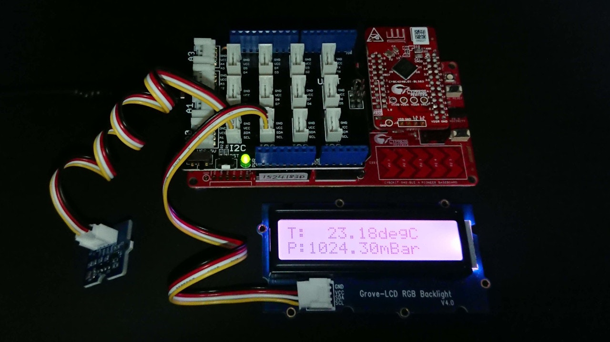

# CY8CKIT-042-BLE-A で気圧を送信

これは、[PSoC Advent Calendar 2019]の20日目に突っ込まれた記事です。

[前回の記事][GBarometer]では、[**絶対圧センサ評価モジュール**][ssci PSensor]からデータを取得して[**Grove**][Grove]の[**スターターキット**][Grove Starter Kit]に入っていた[**Grove LCD RGB Backlight**][Grove LCD RGB Backlight]というボードに気圧を表示させました。
今回は、取得した気圧データを**BLE**を使用して送信します。


## BLEビーコン

**BLE**の使い方にビーコンというものがあります。
これは、一方的に**BLE**のパケットを送信する装置です。
そのパケットの一部に温度や気圧のデータを混ぜておくことで、パケットを受信した装置が温度や気圧を知ることができるという仕組みです。

基本的なBLEビーコンは、[PSoC Advent Calendar 2016]の記事「[**BLE Beacon の初歩**][sonet BLE Beacon Basic]」で作成しましたので、今回もこの時の記事をもとに作成しています。
回路図は、BLEコンポーネントが追加されただけです。


## メインループによる時間管理

BLEビーコンは、比較的に手軽に使えます。
それは、片方向の通信だからです。
通信相手とデータの送受信を行う場合、通常は通信相手と同期して処理を行う必要があります。
そのため、タスクの時間管理が大変です。
BLEビーコンは、自分の都合でパケットを送信すればよいので楽なのですが、そうはいっても、処理をブロックさせるわけにはいかないので、最低限の時間管理は必要です。

タスクの時間管理を行うために、気圧測定ループをステートマシンに作り替えて、さらにBLEパケットの送信処理も加えました。

```c:main.c
        // ステートマシンのディスパッチャは500msごとに動作する
        if (wdt_Flag) {
            wdt_Flag = 0;

            // ステートマシン
            switch (state) {
                case ST_INIT:
                    // BLEシステムの初期化待ち
                    if (initialized) {
                        state = ST_FORCE;
                    }
                    break;
                case ST_FORCE:
                    // 温度と気圧の測定開始
                    I2C_SENSOR_Force();
                    state = ST_CALCULATE;
                    break;
                case ST_CALCULATE:
                    // 温度と気圧を計算する
                    I2C_SENSOR_ReadRawData();
                    temp = I2C_SENSOR_GetTemperature();
                    pressure = I2C_SENSOR_GetPressure();
                    f_temp = (uint8)(temp / 40.0f * (TEMP_40 - TEMP_ZERO)) + TEMP_ZERO;
                    f_hum = (uint8)((pressure - 950.0) / 50.0 * (HUM_50 - HUM_ZERO)) + HUM_ZERO;
                    // パケットはPACKET_PERIODごとに送信される
                    if (++tick >= PACKET_PERIOD) {
                        tick = 0;
                        state = ST_SEND;
                    } else {
                        state = ST_SHOW;
                    }
                    break;
                case ST_SEND:
                    // Major フィールドの設定
                    cyBle_discoveryData.advData[ID_OFFSET] = f_id;
                    
                    // Minor フィールドの設定
                    cyBle_discoveryData.advData[TEMP_OFFSET] = f_temp;
                    cyBle_discoveryData.advData[HUM_OFFSET] = f_hum;

                    // Advertisement パケットの送信を開始する
                    CyBle_GappStartAdvertisement(CYBLE_ADVERTISING_FAST);
                    
                    state = ST_STOP;
                    break;
                case ST_STOP:                
                    // Advertisement パケットの送信を止める
                    CyBle_GappStopAdvertisement();
                    state = ST_SHOW;
                    break;
                case ST_SHOW:
                    // 温度と気圧をLCDに表示する
                    sprintf(sbuf, "T:%7.2fdegC", temp);
                    I2C_LCD_Position(0, 0x80);  // locate to 0,0
                    I2C_LCD_PrintString(sbuf);
                    sprintf(sbuf, "P:%7.2fmBar", pressure);
                    I2C_LCD_Position(0, 0xA8);  // locate to 1,0
                    I2C_LCD_PrintString(sbuf);
                    state = ST_FORCE;
                    break;
                default:
                    state = ST_INIT;
            }
        }
```

これは、メインループの中に入っている気圧測定処理のディスパッチャです。
500ミリ秒ごとに``wdt_Flag``がセットされるので、そのタイミングで状態遷移をしながら気圧測定とパケットの送信をを行っています。
ステートマシンの状態は、以下の通りです。

|状態|処理|
|:--|:--|
|ST_INIT|BLEデバイスとしての初期化を待っている状態です。初期化が終了するまですべての処理が開始できません。|
|ST_FORCE|気圧センサの測定を開始します。測定結果は、次の500ミリ秒以内に得られることを期待しています。|
|ST_CALCULATE|気圧センサからの測定結果をもとに温度と気圧の補償計算を行います。|
|ST_SEND|BLEのAdvertisementパケットの送信を行います。パケットは、次の500ミリ秒の間に送信されます。|
|ST_STOP|BLEのAdvertisementパケットの送信を停止します。|
|ST_SHOW|温度と気圧をLCDに表示します。

計測中は、``ST_FORCE``, ``ST_CALCULATE``, ``ST_SHOW`` の３状態を順番に遷移しており、1.5秒ごとに測定と表示を行います。
このループを``PACKET_PERIOD``の回数だけ回った時にBLEパケットを送信するための``ST_SEND``, ``ST_STOP``状態に立ち寄り、その回だけは1秒間だけ余分に時間が必要です。
``PACKET_PERIOD``は14に設定してあるので、パケットの送信は22秒ごとに行われることになります。


## アプリはどうする？

BLEビーコンは温度と気圧の情報を送信してくれますが、これを受信するにはアプリを作るか、受信用のハードを作成する必要があります。
今回は、そこまでは作成せずに、[**CYALKIT-E02 Solar-Powered BLE Sensor Beacon Reference Design Kit (RDK)**][CYALKIT-E02]で使用されている**Cypress&reg; BLE-Beacon&trade;** アプリケーションを使用します。

とはいっても、このアプリは温度と湿度を表示させるために用意されているので気圧には対応していません。
そこで、湿度を表示させる代わりに気圧を表示させることにしました。
そのために、BLEビーコンで送信するデータに補正を加えています。

|気圧|湿度|補正パラメータ|
|:-:|:-:|:--|
|1050mBar|100%|-|
|1000mBar|50%|HUM_50 = 114u|
|950mBar|0%|HYM_ZERO = 13u|

このように、1000mBarを50%として950mBarから1050mBarまで測定できるように値を操作しています。


## プロジェクトの完成



プロジェクトを書き込んだら、LCDに温度と気圧が表示されます。
前回の記事と同じ写真に見えるのは気のせいでしょう。

見た目以外では、BLEでデータを受信して確かめる以外に確認しようがありません。


### アプリで見てみたら

**Cypress&reg; BLE-Beacon&trade;** で表示させました。
このアプリには、グラフ表示をさせる機能もあるのですが、温度と気圧は頻繁に変わるものでもないため、リスト表示させました。


このように計算通り22秒ごとにパケットが送信されている様子がわかります。
湿度が74%となっていますが、これは1024mBarに相当する値です。

## GitHub リポジトリ
* [GitHub Repository][repository]

## 関連サイト
* [32-bit ArmR CortexR-M0 PSoCR 4][PSoC 4]
* [PSoCR 4 BLE (Bluetooth Smart)][PSoC 4 BLE]
* [スイッチサイエンスのスターターキットのページ][ssci Starter Kit]
* [スイッチサイエンスの絶対圧センサ評価モジュールのページ][ssci PSensor]

## 関連記事
* [CY8CKIT-042-BLE-A でＬチカ][GLChika]
* [CY8CKIT-042-BLE-A でLCD表示][GLCDShow]
* [CY8CKIT-042-BLE-A でバックライト点灯][GBLChika]
* [CY8CKIT-042-BLE-A で気圧を表示][GBarometer]
* [CY8CKIT-042-BLE-A で気圧を送信][GBLE]

[GLChika]:./chap1.md
[GLCDShow]:./chap2.md
[GBLChika]:./chap3.md
[GBarometer]:./chap4.md
[GBLE]:./chap5.md
[PSoC Advent Calendar 2019]:https://qiita.com/advent-calendar/2019/psoc
[PSoC Advent Calendar 2016]:https://www.adventar.org/calendars/1796
[Switch Science]:https://www.switch-science.com/
[Seeed Studio]:https://www.seeedstudio.com/
[Grove]:https://www.seeedstudio.com/Grove
[Grove Starter Kit]:https://www.seeedstudio.com/Grove-Starter-Kit-for-Arduino-p-1855.html
[ssci Starter Kit]:https://www.switch-science.com/catalog/1812/
[Grove LCD RGB Backlight]:https://www.seeedstudio.com/Grove-LCD-RGB-Backlight.html
[CY8CKIT-042-BLE-A]:https://www.cypress.com/cy8ckit-042-ble-a
[Base Shield V2]:https://www.seeedstudio.com/Base-Shield-V2.html
[Grove LED]:https://www.seeedstudio.com/Grove-Red-LED.html
[PSoC 4]:http://www.cypress.com/psoc4
[PSoC 4 BLE]:https://www.cypress.com/products/psoc-4-ble-bluetooth-smart
[Bridge Control Panel]:https://www.cypress.com/documentation/software-and-drivers/psoc-programmer-secondary-software
[PSoC Creator]:https://www.cypress.com/creator
[NXP]:https://www.nxp.com/
[PCF2119X]:https://www.nxp.com/products/:PCF2119X
[PCA9632]:https://www.nxp.com/products/:PCA9632
[KitProg]:https://www.cypress.com/kitprog
[ssci PSensor]:https://www.switch-science.com/catalog/5329/
[OMRON]:https://www.omron.co.jp/
[2SMPB-02E]:https://www.omron.co.jp/ecb/product-detail?partId=45066
[sonet BLE Beacon Basic]:https://noritan-micon.blog.ss-blog.jp/2016-12-03
[CYALKIT-E02]:https://www.cypress.com/CYALKIT-E02
[repository]:https://github.com/noritan/Advent2019
